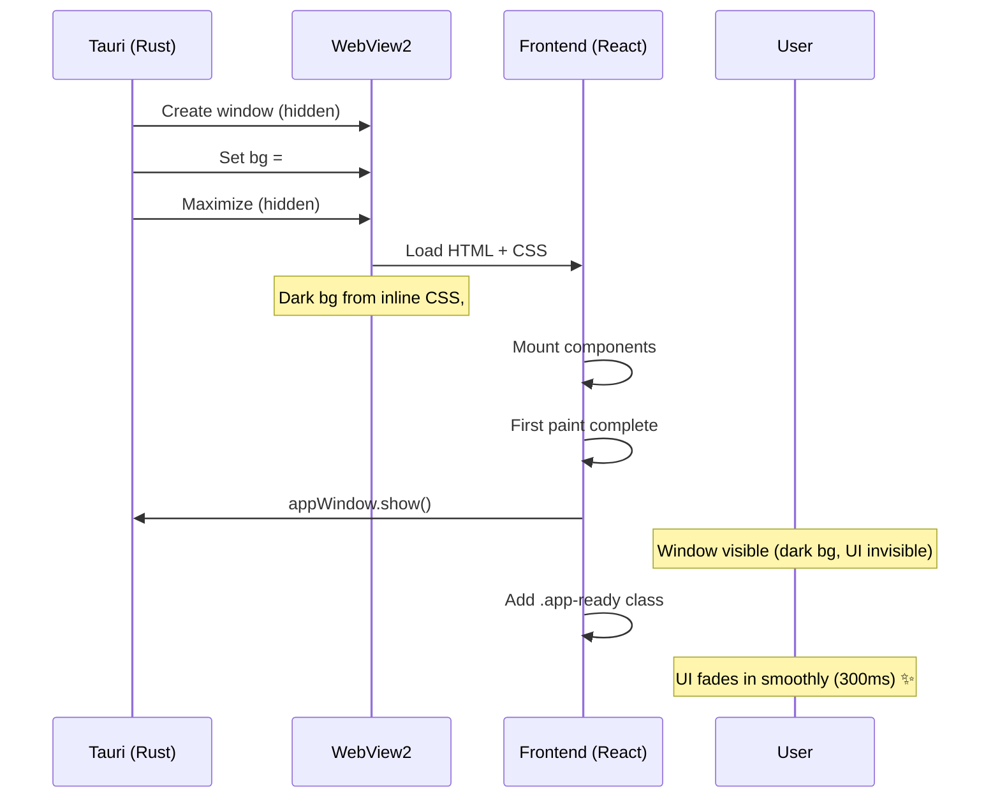

# Fix: White Flash on Desktop App Startup

## ปัญหา
เมื่อเปิด Desktop App (Tauri) จะเห็นหน้าจอ **สีขาว/เทา flash** เป็นเสี้ยววินาที (< 1 sec) ก่อนที่จะแสดง Dark Mode UI จริง — ไม่เหมือน Desktop IDE ที่ขึ้น Dark Page แล้วค่อยๆ ปรากฏเนื้อหา

## สาเหตุ (Root Cause Analysis)

| สาเหตุ | รายละเอียด |
|---|---|
| **`visible: true` ใน config** | Window ถูกแสดงทันทีตอน Tauri สร้าง ก่อน WebView2 โหลด HTML/CSS เสร็จ → เห็น native white background |
| **WebView2 default bg สีเทา** | บน Windows, WebView2 มี default background สีเทาก่อนที่จะ render HTML |
| **`window.show()` ใน Rust `.setup()`** | แม้ย้ายมา setup แล้ว ก็ยังรันก่อน React mount → เห็นหน้าจอเปล่าก่อน UI render |

## ไฟล์ที่แก้ไข

### 1. [tauri.conf.json](file:///d:/pqs-rtn-hybrid-storage/src-tauri/tauri.conf.json) — ซ่อน window ตอนเริ่ม

```diff
-"visible": true
+"visible": false
```

Window เริ่มต้นซ่อน → ไม่เห็นอะไรจนกว่า frontend จะพร้อม

### 2. [main.rs](file:///d:/pqs-rtn-hybrid-storage/src-tauri/src/main.rs) — Set WebView2 bg color + ไม่ show

- ตั้ง WebView2 background เป็น `#010409` (สี Dark Blue ของ App) ผ่าน Windows COM API
- Cast `ICoreWebView2Controller` → `ICoreWebView2Controller2` เพื่อเข้าถึง `SetDefaultBackgroundColor`
- **ไม่เรียก `window.show()`** — ปล่อยให้ frontend ทำ
- Pre-maximize window ขณะยังซ่อนอยู่

```rust
#[cfg(target_os = "windows")]
if let Some(window) = app.get_window("main") {
    let _ = window.with_webview(|webview| unsafe {
        use windows::core::Interface;
        let controller = webview.controller();
        if let Ok(controller2) = controller.cast::<ICoreWebView2Controller2>() {
            let bg = COREWEBVIEW2_COLOR { A: 255, R: 1, G: 4, B: 9 };
            let _ = controller2.SetDefaultBackgroundColor(bg);
        }
    });
}
```

### 3. [Cargo.toml](file:///d:/pqs-rtn-hybrid-storage/src-tauri/Cargo.toml) — เพิ่ม Windows dependencies

```toml
[target.'cfg(windows)'.dependencies]
webview2-com = "0.19"          # WebView2 COM bindings (same as Tauri's internal)
windows = { version = "0.39", features = ["implement"] }  # Interface trait for casting
```

### 4. [main.tsx](file:///d:/pqs-rtn-hybrid-storage/src/main.tsx) — Frontend สั่ง show window + fade-in

```tsx
import { appWindow } from "@tauri-apps/api/window";

// Show window after React mount + first paint
requestAnimationFrame(() => {
  requestAnimationFrame(() => {
    appWindow.show().then(() => {
      // Trigger fade-in after window is visible
      document.getElementById("root")?.classList.add("app-ready");
    });
  });
});
```

Double `requestAnimationFrame` รับประกันว่า browser render frame แรกเสร็จก่อน show
หลัง `show()` สำเร็จ → เพิ่ม class `.app-ready` เพื่อ trigger CSS fade-in transition

### 5. [index.html](file:///d:/pqs-rtn-hybrid-storage/index.html) — Fade-in CSS

```css
#root {
  /* ... existing styles ... */
  opacity: 0;
  transition: opacity 300ms ease-out;
}
#root.app-ready {
  opacity: 1;
}
```

`#root` เริ่มที่ `opacity: 0` → เมื่อ `.app-ready` ถูกเพิ่ม → ค่อยๆ fade-in 300ms

## ลำดับการทำงานใหม่



## ผลลัพธ์

- ✅ **ไม่เห็น white flash** อีกเลย
- ✅ **ไม่เห็น gray flash** อีกเลย
- ✅ **Smooth fade-in** 300ms — ดูมืออาชีพ
- ✅ ทำงานทั้ง Dev mode และ Production build
- ✅ Windows-specific code อยู่ใน `#[cfg(target_os = "windows")]` ไม่กระทบ platform อื่น
